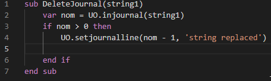
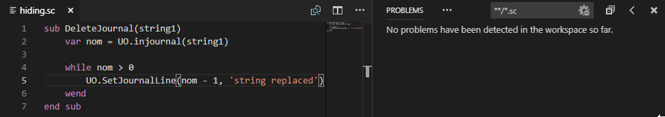

# Injection.VsCode

Yoko Injection support for Visual Studio Code.

You have to install [.NET Core 2.1](https://dotnet.microsoft.com/download/dotnet-core/2.1) to use this extension.

This extension is in very early development stage so there are many bugs
and unimplemented features. If you are interested in this project, please file a bug on [Github](https://github.com/uoinfusion/InjectionScript/issues) or on [Discord](https://discord.gg/Ng3RDke).

## Features

- Editing Yoko Injection scripts in an amazing text editor.
- Code completion

- Source code analysis reports usage of unknown variable, subrutine or keyword

## Known Issues

Implementation is very slow inefficient and incomplete.

## Release Notes

### 0.0.1

Initial release.
